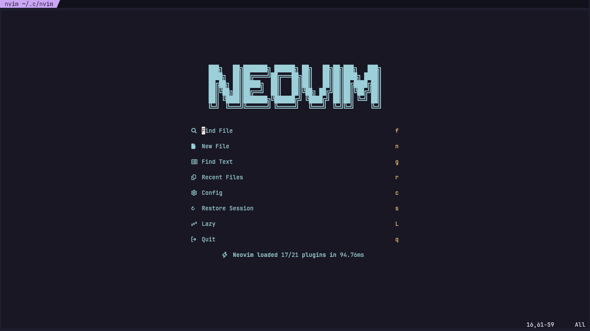
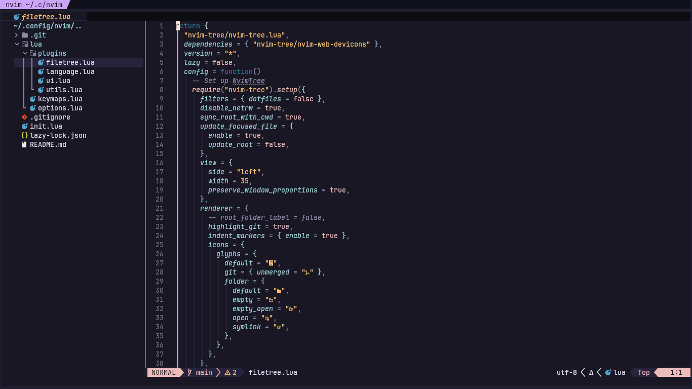
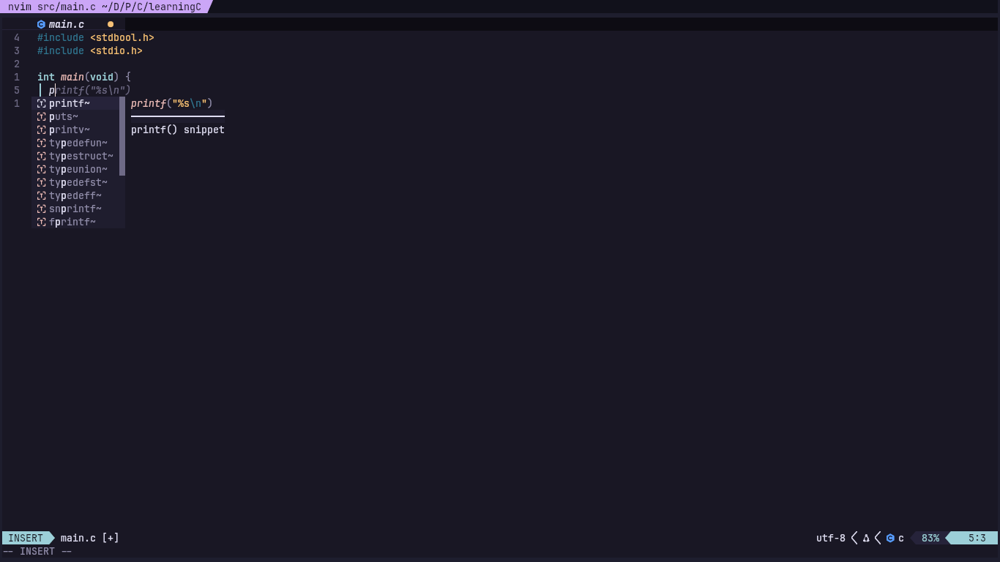
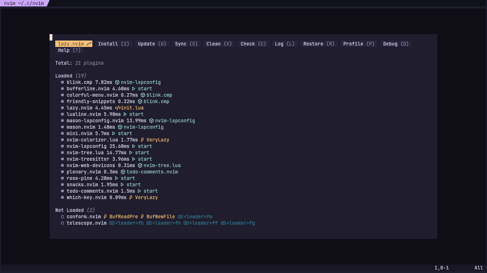
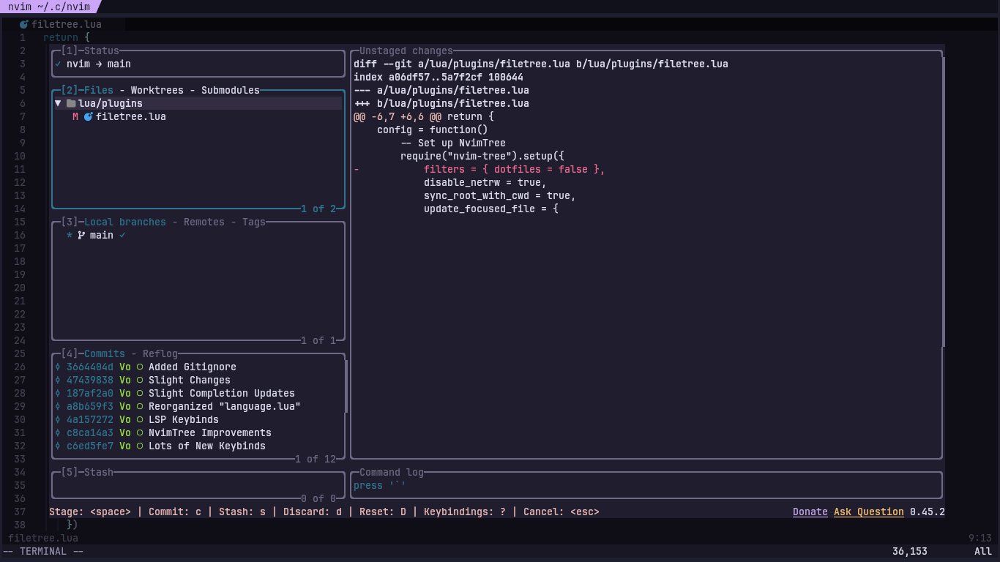

# NvimDots
This is my personal configuration for Neovim using the <a href="https://github.com/folke/lazy.nvim">lazy.nvim</a> plugin manager.

I took some things from <a href="https://nvchad.com/">NVChad</a> and <a href="https://www.lazyvim.org/">LazyVim</a>.
Thanks to these amazing distributions, I discovered some cool new plugins like <a href="https://github.com/Saghen/blink.cmp">blink.cmp</a>
for autocompletion which is far easier and performant compared to <a href="https://github.com/hrsh7th/nvim-cmp">nvim-cmp</a>
and useful keybinds that just makes life easier e.g. pressing `Control + S` keys saves the file which many people are used to because this keybind is used
in literally every text editing software out there like Notepad and Word.

## Install
```bash
# Linux / MacOS (Unix)
git clone https://github.com/Voxi0/NvimDots ~/.config/nvim && nvim

# Windows CMD
git clone https://github.com/NvChad/starter %USERPROFILE%\AppData\Local\nvim && nvim

# Windows Powershell
git clone https://github.com/NvChad/starter $ENV:USERPROFILE\AppData\Local\nvim && nvim
```

## Post-Install
- Run `:Lazy sync` command in Neovim to update all plugins.
- Run `:MasonInstallAll` command after `lazy.nvim` finishes downloading all the plugins.
- Delete the `.git` folder and `.gitignore` file from where NvimDots was installed (Depends on your system).

## Uninstall
```bash
# Linux / MacOS (Unix)
rm -rf ~/.config/nvim
rm -rf ~/.local/state/nvim
rm -rf ~/.local/share/nvim

# Windows CMD
rd -r ~\AppData\Local\nvim
rd -r ~\AppData\Local\nvim-data

# Windows PowerShell
rm -Force ~\AppData\Local\nvim
rm -Force ~\AppData\Local\nvim-data
```

## Showcase






## Contributing
Please do add new Github issues if you have any problems, I will look into them as soon as I can although I cannot make any guarantees. Pull requests are
welcome but for any major changes, please open an issue first to discuss what changes you desire.
